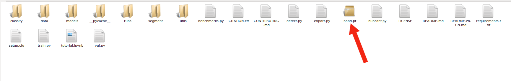
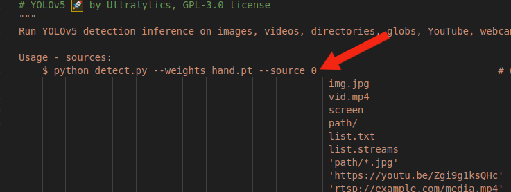
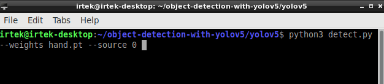

# object-detection-with-yolov5

Tutorial on creating object detection programs using yolov5. Starting with collect data, labelling, training dataset, and deploy models to program detection. In this repository uses hand detection as an example. Before going to the next steps, first install yolov5 with Cuda in object-detection-with-yolov5 folder. For the installation tutorial, you can see this link: https://github.com/Yumnasilvia/Yolov5-with-opencv-cuda-jetson.git


## Collect Data

Run the following program and collect data of at least 150 image data.
```bash
  cd object-detection-with-yolov5
  cd Collect_Data
  python collect_data
```
## Labelling
Labeling uses roboflow, here is the website link https://roboflow.com/.

## Training Dataset
Open google colab https://colab.google/
and open object-detection-with-yolov5/Training_Data/ObjectDetection.ipynb. Change in this section :
```bash
!pip install roboflow
from roboflow import Roboflow
rf = Roboflow(api_key="your_api_key_project_in_roboflow")
project = rf.workspace("your_workspace").project("your_project")
dataset = project.version(1).download("yolov5")
```
## Deploy Model to Program Detection
- Move the model file into the yolov5 folder.
example: hand.pt

- Open detect.py and copy this syntax.

- Running program on terminal
example: hand detection program
```bash
python3 detect.py --weights hand.pt --source 0 
```


format:
```bash
python3 detect.py --weights <your_model>.pt --source <port_camera> 
```
## Authors

- [@Yumnasilvia](https://www.github.com/Yumnasilvia)

